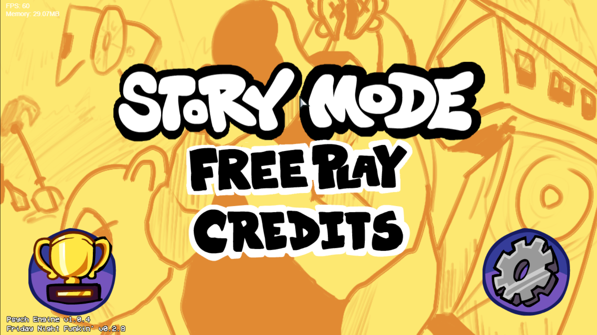
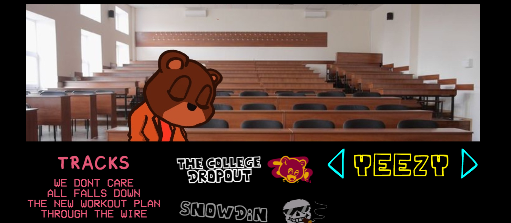
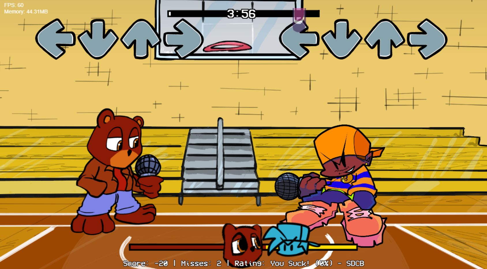
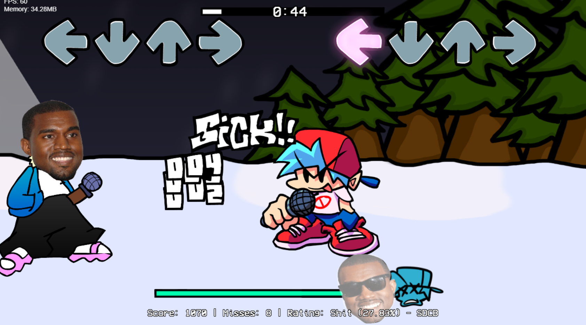

# Yeezy Night Funkin' (YZY WK 0.1.4)

Ye (FKA Kanye West) has hit Friday Night Funkin'! A fan-made [Psych Engine](https://github.com/ShadowMario/FNF-PsychEngine) mod where you play the charts to many of his biggest hits.

### ▶ [Play it in your browser](https://smiledemic.github.io/yeezy-night-funkin/)

No download needed. Click the page once after it loads so your browser allows sound, then use the menu.

## Screenshots

| | |
|---|---|
|  |  |
| **Main menu** | **Story Mode week list** |
|  |  |
| **Versus the Dropout Bear** | **Snowdin** |

## What's in it

| Week | Tracks |
|---|---|
| The College Dropout | We Dont Care, All Falls Down, The New Workout Plan, Through The Wire |
| Snowdin | Snowdin, Hopes And Dreams, Finale |
| Freeplay | Freakye |

Weeks and songs are listed in `mods/yzypsychbuild/weeks/`, so more can be added to the menus without touching the engine.

## Controls

Default Psych Engine controls. You can rebind them in **Options**.

- **Notes:** arrow keys, or WASD, or D F J K
- **Select / back:** Enter / Esc

## Browser version notes

- The first load downloads the whole mod (about 160 MB), so it can take a while on a slow connection.
- Browsers block sound until you click or press a key on the page.
- This build runs in the browser, so anything that needs the desktop (for example Lua scripts) may be missing or behave differently from the Windows version.
- Hard refresh (Ctrl+Shift+R) if you don't see the latest update.

## Credits

**Mod team** (from the in-game Credits menu):

| Who | Role |
|---|---|
| ant | Head of team |
| spook | Team manager |
| icey | Art, composing, charting, beta testing, macOS porter |
| husk | Charting, composing, character offsets |
| Jazzy | Coder and charter |
| ss (stareatswag) | Charter and artist, Sansye sprites |
| peej | Charter and artist |
| klaw | Artist |
| kromer | Artist |
| humourous | Artist |

**Built with:**

- [Psych Engine](https://github.com/ShadowMario/FNF-PsychEngine) v1.0.4 by Shadow Mario and contributors
- [HaxeFlixel](https://haxeflixel.com/), [OpenFL](https://www.openfl.org/) and [Lime](https://lime.openfl.org/)
- Friday Night Funkin' by [The Funkin' Crew](https://github.com/FunkinCrew/Funkin)

## Disclaimer

This is an unofficial, non-commercial fan project. It is not affiliated with or endorsed by Ye, Kanye West, or the Friday Night Funkin' team. All music and characters belong to their respective owners. If you are a rights holder and want something taken down, open an issue and it will be removed.

## Building the web version yourself

This repo is the compiled HTML5 build (the folder produced by `lime build html5`), served with GitHub Pages. To run it locally:

```
npx http-server . -p 8080 -c-1
```

then open `http://127.0.0.1:8080`.
